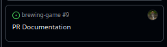

# GitHub Workflow

To aid seamless collaboration on this shared repository, this document outlines the workflow involved in various processes that all developers are to follow.

## Branches Overview

### `main`

This branch is for work that is **finished**, **approved**, and **complete**. It cannot be pushed to. It is updated only by opening a pull request from `dev` to `main` at the completion of each major milestone.

All work on this branch must be free of major bugs, and easily executable (built) so that a non-technical person can clone it and run the game without issues or prior knowledge of its environment.

### `dev`

This branch consitutes the latest development version of the application. It is accessed and used exclusively by developers. Similarly to `main`, it cannot be pushed to and it can only receive updates at the completion of each ticket, and only by opening a **pull request** from `T-<number>` to `dev`.

All work in this branch is not intrinsically free of bugs or errors, it is simply the combined state of all completed tickets.

Developers **must** ensure that they always have the latest version of `dev` pulled before opening a new ticket (`T-<number>`) branch.

### `T-<number>`

Those branches constitute individual tickets. They are always created from the **latest** version of dev, and deleted upon the ticket's completion.

The "<number>" part in these branches' names must match the number of the ticket they correspond to as seen on kanban; e.g. 

This ticket is numbered 9, so its corresponding branch **must** be named `T-9` (short for "Ticket-9". **CASE SENSITIVE!!!**).

This naming convention aids identification. It is so that a hypothetical inspector can look at our kanban, find the ticket they're interested in, and immediately know where to find it in the repository.

## Starting work on a new ticket

To start a work on a new ticket, follow these steps:

1. Identify the ticket number (`ticket_number`) on kanban,

2. In your local repository, pull the latest version of `dev`,

3. Create a new branch named `T-<ticket_number>` from the newly updated version of `dev`,

4. Checkout to your newly created branch.

Having done all this you will have successfully isolated the work of your ticket from the rest of the repository. You can begin work now.

## Submitting completed work

Once you completed a ticket and pushed your work to your ticket's branch, to then finalize the ticket, you must open a pull request from your branch to `dev` on GitHub. This opens the **review process**.

**Note:** Always make sure you're merging to `dev` and not `main`. To help avoid this mistake, the default branch was set to `dev` so GitHub will try merging to it by default. 

## Review Process

While your work is being reviewed, it is your responsibility to:

1. engage in the discussion with the reviewer, 

2. resolve any conflicts with the base branch (`dev`), 

3. merge the branch once approved, 

4. and delete the branch once merged. 

Make sure you delete the **branch** and **NOT** the **ticket**.

If the reviewer asks for changes in your work, it is your responsibility as the ticket's owner to seek resolution. This can be done by either providing the requested changes, or disputing them with the reviewer through communication. It is important to note that the reviewer has the final say. If you disputed a change, and after some back and forth, the reviewer is still asking for those changes, you must provide them. This is because your view as the ticket's owner is intrinsically biased. Keep in mind that it is never personal. The reviewers must (and will) always prioritize the sake of the project. If you feel that the reviewer is violating this rule, reach out to the rest of the team!

